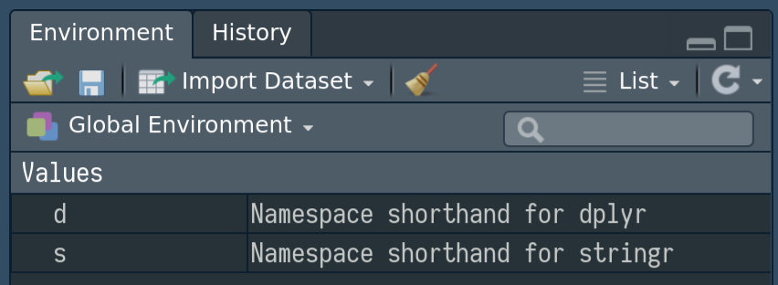

<!-- README.md is generated from README.Rmd. Please edit that file -->

# importAs

This package helps mimic the idiomatic python importing of packages such
as

``` python
import dplyr as d
```

In order to mimic this as closely as possible, the function `importAs`
takes a package name and a (short?) name for that and creates a linkage.
Helpful information is provided when printing and within the RStudio
Environment pane

``` r
importAs(dplyr, d)

## or ##

dplyr %importAs% d

d
#> Namespace 'dplyr' can be referenced as 'd'
#> [1] "dplyr"
```



``` r
d::filter(mtcars, cyl == 4, am == 1)
#>    mpg cyl  disp  hp drat    wt  qsec vs am gear carb
#> 1 22.8   4 108.0  93 3.85 2.320 18.61  1  1    4    1
#> 2 32.4   4  78.7  66 4.08 2.200 19.47  1  1    4    1
#> 3 30.4   4  75.7  52 4.93 1.615 18.52  1  1    4    2
#> 4 33.9   4  71.1  65 4.22 1.835 19.90  1  1    4    1
#> 5 27.3   4  79.0  66 4.08 1.935 18.90  1  1    4    1
#> 6 26.0   4 120.3  91 4.43 2.140 16.70  0  1    5    2
#> 7 30.4   4  95.1 113 3.77 1.513 16.90  1  1    5    2
#> 8 21.4   4 121.0 109 4.11 2.780 18.60  1  1    4    2
```

For full details, see the vignette
[‘namespace-shorthands’](https://jonocarroll.github.io/importAs/articles/namespace-shorthands.html).

## Installation

You can install the development version of `importAs` with

``` r
## install.packages("devtools")
devtools::install_github("jonocarroll/importAs")
```
